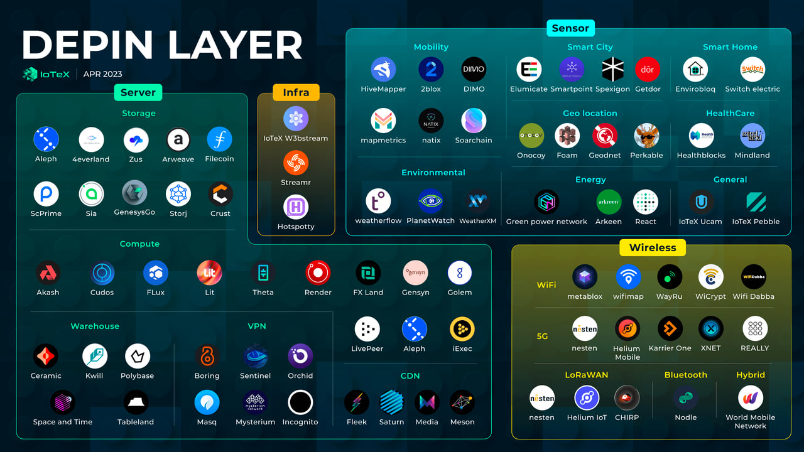

# awesome-depin
>  A curated list of awesome things related to DePIN (Decentralized Physical Infrastructure Networks)

## What is DePIN?
DePIN, or Decentralized Physical Infrastructure Networks, refers to networks that connect physical hardware devices in a decentralized manner. These networks are supported by cryptocurrency-based rewards and incentives. Also known as TIPIN, PoPW, or EdgeFi, DePIN aims to bridge the digital and physical spaces using crypto-based technologies. It focuses on creating democratized technologies that can compete with or replace centralized offerings. Participants who provide the necessary hardware to the network contribute to its adoption and decentralization, and are rewarded with cryptocurrencies. DePIN has the potential to expand the use cases of cryptocurrencies beyond finance and transactions, driving the development of Web3 and solidifying cryptocurrencies as vital resources.

## The DePIN Landscape

## Projects

### Decentralized Wireless
#### 5G 
- Helium 5G: https://hellohelium.com/
- XNET https://www.xnet.company/
- Karrier One: https://karrier.one/
- REALLY: https://really.com/

#### LoRaWAN
- Helium IoT: https://www.helium.com/
- Drop Wireless: https://dropwireless.io/
- Chirp https://chirptoken.io/

#### WiFi
- Wayru: https://www.wayru.io/
- Metablox: https://metablox.io/
- Drop Wireless: https://dropwireless.io/
- Wicrypt: https://wicrypt.com/
- WifiDabba: https://www.wifidabba.com/

#### Bluetooth Low Energy 
- Nodle: https://www.nodle.com/
- Drop Wireless: https://dropwireless.io/

#### Hybrid 
- World Mobile: https://worldmobile.io/

### Decentralized Sensor 
#### Mobility
- DIMO: https://dimo.zone/
- Hivemapper: https://hivemapper.com/
- Natix: https://www.natix.network/
- 2blox: https://2blox.io/
- Mapmetrics: https://www.natix.network/
- Soarchain: https://www.soarchain.com/

#### ESG
- PlanetWatch: https://www.planetwatch.io/
- WeatherXM: https://weatherxm.com/
- Weatherflow: https://weatherflow.com/

#### Geo Location
- GEODNET: https://geodnet.com/
- FOAM: https://foam.space/
- Onocoy: https://www.onocoy.com/

#### Energy
- React: https://www.reactnetwork.io/
- Arkreen: https://arkreen.com/
- GPN: https://www.greenpowern.com/

#### Health
- Healthblocks: https://www.healthblocks.ai/
- Mindland: https://mndlnd.xyz/

#### Smart Home
- Envirobloq: https://envirobloq.io/

### Decentralized Server
#### Compute
- Render: https://rendertoken.com/
- Akash: https://akash.network/
- Gensyn: https://www.gensyn.ai/
- Cudos: https://www.cudos.org/
- Flux: https://runonflux.io/
- Aleph: https://aleph.im/
- Lit: https://litprotocol.com/
- Functionland: https://fx.land/
- Golem: https://www.golem.network/
- iExec: https://iex.ec/
- Theta: https://www.thetatoken.org/
- Livepeer: https://livepeer.org/

#### Storage
- Filecoin: https://filecoin.io/
- Arweave: https://www.arweave.org/
- Sia: https://sia.tech/
- Storj: https://www.storj.io/
- Crust: https://crust.network/
- ScPrime: https://scpri.me/
- Zus: https://zus.network/
- 4EVERLAND: https://www.4everland.org/
- Ceramic: https://ceramic.network/
- Space and Time: https://www.spaceandtime.io/
- Kwil: https://www.kwil.com/
- Polybase: https://polybase.xyz/
- Tableland: https://tableland.xyz/

#### VPN
- Orchid: https://www.orchid.com/
- Mysterium: https://www.mysteriumvpn.com/
- Boring Protocol: https://boringprotocol.io/
- Sentinel: https://sentinel.co/
- MASQ: https://masq.ai/
- Incognito: https://incognito.org/

#### CDN 
- Fleek: https://fleek.co/
- Saturn: https://saturn.tech/
- Media: https://www.media.network/
- Meson https://www.meson.network/

### DePIN Specific Infrastructure 
#### Off-chain Compute
- W3bstream: https://w3bstream.com
- Streamr: https://streamr.network/

#### Tools
- Hotspotty: https://hotspotty.net/

#### L1/L2
- IoTeX: https://iotex.io/
- Eclipse: https://www.eclipse.builders/

## Analytics
- DePINDD: https://depindd.com/
- wholovesburrito: https://wholovesburrito.com/

## Hardware Sales
- Mining Chamber: https://www.miningchamber.com/

## Blogposts and Social Media
- Connor Lovely: https://substack.com/@connorbuildsinpublic
- DePIN State: https://twitter.com/DePINState
- Future Money Group: https://twitter.com/fmgroupxyz
