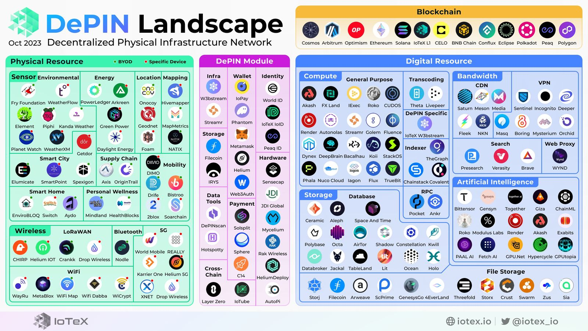

# awesome-depin
>  A curated list of awesome things related to DePIN (Decentralized Physical Infrastructure Networks)

Welcome to our [DePIN (Decentralized Physical Infrastructure Networks)](https://iotex.io/blog/what-are-decentralized-physical-infrastructure-networks-depin/) repository. This is your go-to source for codebases, research papers, projects, and applications. We value your input and contributions - feel free to open an issue or submit a pull request with any proposed changes or additions. Let's make this the best resource for DePIN!

## What is DePIN?
[DePIN](https://iotex.io/blog/what-are-decentralized-physical-infrastructure-networks-depin/), or Decentralized Physical Infrastructure Networks, refers to networks that connect physical hardware devices in a decentralized manner. These networks are supported by cryptocurrency-based rewards and incentives. Also known as [TIPIN](https://medium.com/@mikezajko_16091/token-incentivized-physical-infrastructure-networks-3548b3182d82), [PoPW](https://multicoin.capital/2022/04/05/proof-of-physical-work/), or [EdgeFi](https://medium.com/borderless-capital/edgefi-597b9c747a94), DePIN aims to bridge the digital and physical spaces using crypto-based technologies. It focuses on creating democratized technologies that can compete with or replace centralized offerings. Participants who provide the necessary hardware to the network contribute to its adoption and decentralization, and are rewarded with cryptocurrencies. DePIN has the potential to expand the use cases of cryptocurrencies beyond finance and transactions, driving the development of Web3 and solidifying cryptocurrencies as vital resources.

## The DePIN Landscape

## Projects

### Decentralized Wireless
#### 5G 
- [Helium 5G](https://hellohelium.com)
- [XNET](https://www.xnet.company)
- [Karrier One](https://karrier.one)
- [REALLY](https://really.com)

#### LoRaWAN
- [Helium IoT](https://www.helium.com)
- [Drop Wireless](https://dropwireless.io)
- [Chirp](https://chirptoken.io)
- [Crankk](crankk.io)
- [ThingsIX](thingsix.com)

#### WiFi
- [Wayru](https://www.wayru.io)
- [Metablox](https://metablox.io)
- [Drop Wireless](https://dropwireless.io)
- [Wicrypt](https://wicrypt.com)
- [WifiDabba](https://www.wifidabba.com)

#### Bluetooth Low Energy 
- [Nodle](https://www.nodle.com)
- [Drop Wireless](https://dropwireless.io)

#### Hybrid 
- [World Mobile](https://worldmobile.io)
- [Fry Foundation](https://www.fryfoundation.com)

### Decentralized Sensor 
#### Mobility
- [DIMO](https://dimo.zone)
- [Hivemapper](https://hivemapper.com)
- [Natix](https://www.natix.network)
- [2blox](https://2blox.io)
- [Mapmetrics](https://mapmetrics.org)
- [Soarchain](https://www.soarchain.com)

#### ESG
- [PlanetWatch](https://www.planetwatch.io)
- [WeatherXM](https://weatherxm.com)
- [Weatherflow](https://weatherflow.com)

#### Geo Location
- [GEODNET](https://geodnet.com)
- [FOAM](https://foam.space)
- [Onocoy](https://www.onocoy.com)

#### Energy
- [React](https://www.reactnetwork.io)
- [Arkreen](https://arkreen.com)
- [GPN](https://www.greenpowern.com)

#### Health
- [Healthblocks](https://www.healthblocks.ai)
- [Mindland](https://mndlnd.xyz)

#### Hybrid
- [Fry Foundation](https://www.fryfoundation.com/)
  
#### Smart Home
- [Envirobloq](https://envirobloq.io)

### Decentralized Server
#### Compute
- [StackOS](https://www.stackos.io)
- [Render](https://rendertoken.com)
- [Akash](https://akash.network)
- [Gensyn](https://www.gensyn.ai)
- [Cudos](https://www.cudos.org)
- [Flux](https://runonflux.io)
- [Aleph](https://aleph.im)
- [Lit](https://litprotocol.com)
- [Functionland](https://fx.land)
- [Golem](https://www.golem.network)
- [iExec](https://iex.ec)
- [Theta](https://www.thetatoken.org)
- [Livepeer](https://livepeer.org)

#### Storage
- [Filecoin](https://filecoin.io)
- [Arweave](https://www.arweave.org)
- [Sia](https://sia.tech)
- [Storj](https://www.storj.io)
- [Crust](https://crust.network)
- [ScPrime](https://scpri.me)
- [Zus](https://zus.network)
- [4EVERLAND](https://www.4everland.org)
- [Ceramic](https://ceramic.network)
- [Space and Time](https://www.spaceandtime.io)
- [Kwil](https://www.kwil.com)
- [Polybase](https://polybase.xyz)
- [Tableland](https://tableland.xyz)

#### VPN
- [Orchid](https://www.orchid.com)
- [Mysterium](https://www.mysteriumvpn.com)
- [Boring Protocol](https://boringprotocol.io)
- [Sentinel](https://sentinel.co)
- [MASQ](https://masq.ai)
- [Incognito](https://incognito.org)
- [Fry Foundation](https://www.fryfoundation.com/)
- [NYM](https://nymvpn.com)

#### CDN 
- [Fleek](https://fleek.co)
- [Saturn](https://saturn.tech)
- [Media](https://www.media.network)
- [Meson](https://www.meson.network)

### DePIN Specific Infrastructure 
#### Off-chain Compute
- [W3bstream](https://w3bstream.com)
- [Streamr](https://streamr.network)

#### Tools
- [Hotspotty](https://hotspotty.net)
- [Relay](https://www.relaywireless.com)
- [Solsplits](https://solsplits.xyz/)
- [Mycelium Testbed](https://myceliumnetworks.com)

#### L1/L2
- [IoTeX](https://iotex.io)
- [Eclipse](https://www.eclipse.builders)

## Analytics
- [DePINDD](https://depindd.com)
- [wholovesburrito](https://wholovesburrito.com)
- [CoinGecko](https://www.coingecko.com/en/categories/depin)
- [DePINScan](https://depinscan.io/)

## Hardware Sales
- [Mining Chamber](https://www.miningchamber.com)

## Blogposts and Social Media
- [Connor Lovely](https://substack.com/@connorbuildsinpublic)
- [DePIN State](https://twitter.com/DePINState)
- [Future Money Group](https://twitter.com/fmgroupxyz)
- [Meta Light](https://medium.com/@meta-light)
- [Parlay Labs](https://parleylabs.com/blog/)

## Podcasts
- [Proof of Coverage Podcast](https://www.youtube.com/channel/UC5u5Po0RmkaSxen-1MF5nJg?app=desktop)
- [Moonshot Research Podcast](https://moonshotresearch.buzzsprout.com/)
- [The Hotspot Podcast](https://thehotspot.co/)
- [Unleashing DeWi Podcast](https://tunein.com/podcasts/Technology-Podcasts/Unleashing-DeWi-p1989062/)

## Awesome DePIN videos and presentations
- [DePIN Blockchaince Keynote](https://www.youtube.com/watch?v=SKbVfK-fIAs)
- [EthDenver '23: DePIN W3bstream- The next big thing in Web3](https://www.youtube.com/watch?v=jJzY5i3SIV8)
- [Use off-chain price feeds in your DePIN dApp built on IoTeX](https://www.youtube.com/watch?v=x7NlClgGuSk)
- [Build a DePIN bike-sharing dApp with IoTeX (Episode 1)](https://www.youtube.com/watch?v=_8eOv0fmMgE&t=619s)
- [Build a DePIN bike-sharing dApp with IoTeX (Episode 2)](https://www.youtube.com/live/ENteptPNcDo?si=4aaNiTYBtk9tEKd8&t=668)
- [Build a DePIN bike-sharing dApp with IoTeX (Episode 3)](https://www.youtube.com/watch?v=hW8EDrU-UGQ)
- [Solana & IoTeX DePIN Ecosystem](https://youtu.be/53KO9WMeGVw?si=LJaK-NzkwILFVZT7)

## Jobs
- [EV3 Job Board](https://jobs.ev3.xyz/jobs)

## Research Conferences, Workshops and Symposiums
- [The First International Workshop on Decentralized Physical Infrastructure Networks (DePIN 2023)](https://wfiot2023.iot.ieee.org/1st-international-workshop-decentralized-physical-infrastructure-networks-depin-2023)
- [IEEE International Conference on Blockchain and Cryptocurrency (ICBC 2023)](https://icbc2023.ieee-icbc.org/)
- [The 6th IEEE International Conference on Blockchain (Blockchain 2023)](https://ieee-cybermatics.org/2023/blockchain/)
- [International Conference on Blockchain (ICBC 2023)](https://www.servicessociety.org/icbc)
- [The 5th ACM International Symposium on Blockchain and Secure Critical Infrastructure (BSCI 2023)](http://www.cloud-conf.net/bsci/2023/)
- [The Fifth ACM International Workshop on Blockchain-enabled Networked Sensor Systems (BlockSys 2023)](https://acmblocksys.github.io/blocksys2023/)
- [The 3rd EAI International Conference on Blockchain Technology and Emerging Applications (BlockTEA 2023)](https://blocktea.eai-conferences.org/2023/)
- [The 2023 5th Blockchain and Internet of Things Conference (BIOTC 2023)](http://www.biotc.net/)
- [IEEE DePIN Workshop 2023](https://bit.ly/3RO25QD)
